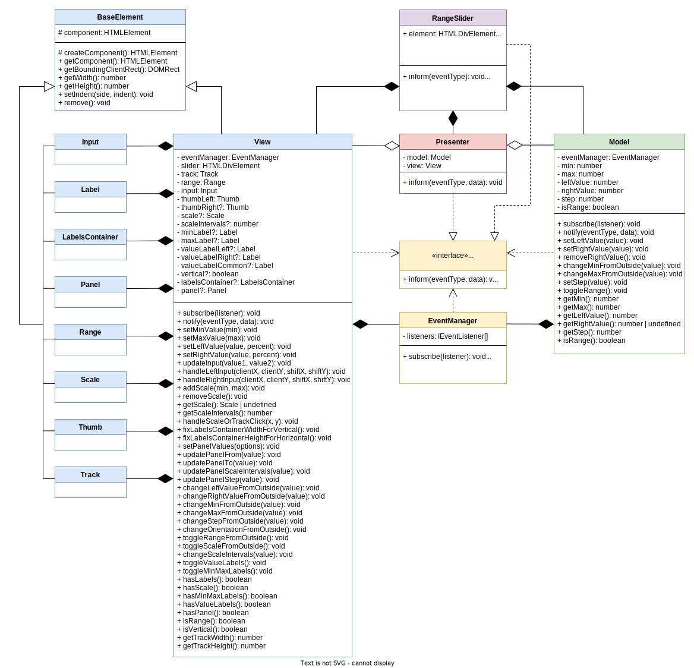
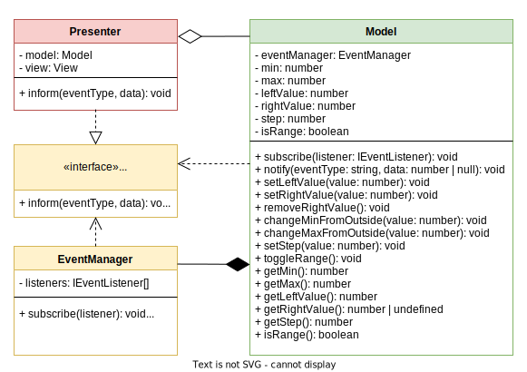
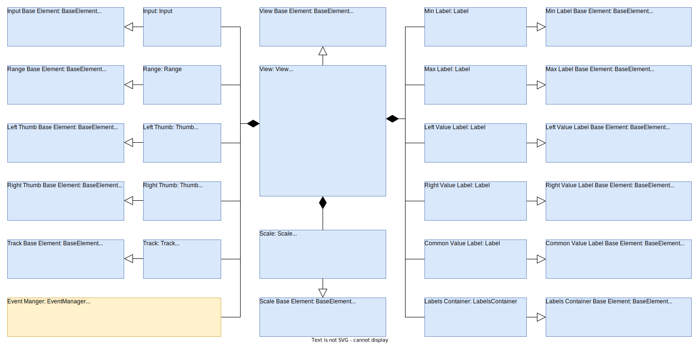
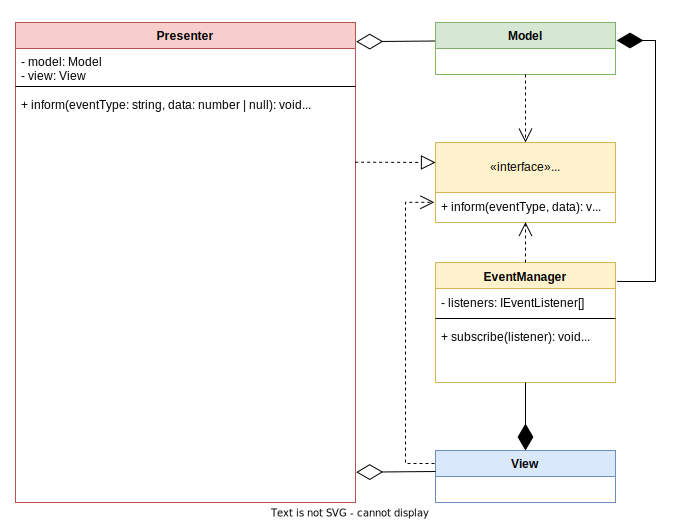
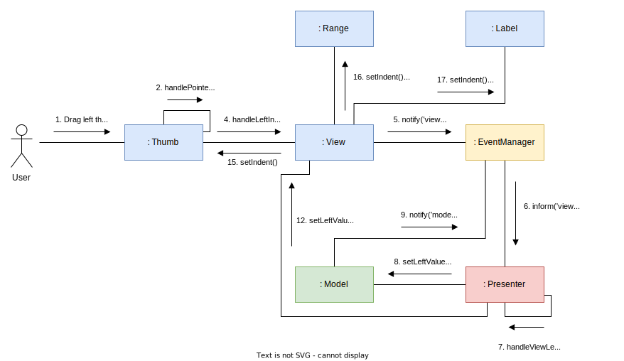

# RangeSlider
Easy to use, flexible and responsive range slider.
[Demo](https://olga-smart.github.io/FSD_4/)

## Table of Contents
1. [Description](#description)
2. [Key Features](#key-features)
3. [Dependencies](#dependencies)
4. [Usage](#usage)
5. [Initialization](#initialization)
6. [Settings](#settings)
7. [Public Methods](#public-methods)
8. [Events](#events)
9. [Under the Hood](#under-the-hood)

## Description
* RangeSlider — cool, comfortable, responsive and easily customizable range slider
* Supports events and public methods, has flexible settings, can be completely altered with CSS
* Cross-browser: Google Chrome, Mozilla Firefox 3.6+, Opera 12+, Safari 5+, Internet Explorer 8+
* RangeSlider supports touch-devices (iPhone, iPad, Nexus, etc.).

## Key Features
* Any number of sliders at one page without conflicts and big performance problems
* Two slider types: single (1 slider) and double (2 sliders)
* Support of negative and fractional values
* Ability to set custom step
* Ability to disable UI elements (min and max, current value, scale)
* Slider writes its value right into input value field. This makes it easy to use in any html form
* Any slider value can be set through data-attribute (eg. data-min="10")
* Slider supports external methods to control it after creation

## Dependencies
* [jQuery 1.8.x+](https://jquery.com/)

## Usage
Add the following libraries to the page:
* jQuery
* rangeSlider.min.js

Add the following stylesheets to the page:
* rangeSlider.min.css

## Initialization
1. Add div with classes 'range-slider' and 'js-range-slider' to the page.
2. Call ionRangeSlider on the element:
```javascript
$('.js-range-slider').rangeSlider();
```

Parameters can be passed as an object:
```javascript
$('.js-range-slider').rangeSlider({
  min: 0,
  max: 100,
  range: true,
  leftValue: 25,
  rightValue: 75,
  step: 1,
  minMaxLabels: true,
  valueLabels: true,
  vertical: false,
  scale: true,
  scaleIntervals: 5,
  panel: false,
});
```

or using data-* attributes:
```html
<div class="range-slider js-range-slider"
  data-min="0"
  data-max="100"
  data-range="true"
  data-left-value="25"
  data-right-value="75"
  data-step="1"
  data-min-max-labels="true"
  data-value-labels="true"
  data-vertical="false"
  data-scale="true"
  data-scale-intervals="5"
  data-panel="false"
>
</div>
```

## Settings
| Option           | Data-Attr              | Defaults | Type    | Description          |
| ---              | ---                    | ---      | ---     | ---                  |
| `min`            | `data-min`             | `0`      | number  | Slider minimum value |
| `max`            | `data-max`             | `100`    | number  | Slider maximum value |
| `range`          | `data-range`           | `true`   | boolean | False for one handle, true for two handles |
| `leftValue`      | `data-left-value`      | `25`     | number  | Start position for left/bottom handle (or for single handle) |
| `rightValue`     | `data-right-value`     | `75`     | number  | Start position for right/top handle (or for single handle) |
| `step`           | `data-step`            | `1`      | number  | Slider`s step. Always > 0. Could be fractional |
| `minMaxLabels`   | `data-min-max-labels`  | `true`   | boolean | Shows min and max labels |
| `valueLabels`    | `data-value-labels`    | `true`   | boolean | Shows from and to labels |
| `vertical`       | `data-vertical`        | `false   | boolean | Makes slider vertical |
| `scale`          | `data-scale`           | `false`  | boolean | Shows scale |
| `scaleIntervals` | `data-scale-intervals` | `5`      | number  | Number of scale intervals |
| `panel`          | `data-panel`           | `false`  | boolean | Enables panel for interactive slider settings |

## Public Methods

To use public methods, at first you must save slider instance to variable:

```javascript
// Launch plugin
$('.js-range-slider').rangeSlider();

// Saving it's instance to variable
const slider = $('.js-range-slider').data('rangeSlider');

// Fire public method
slider.setLeftValue(50)

// Method calls can be chained
slider.setLeftValue(50).setRightValue(80).setStep(10);
```

There are 3 public methods, whose names speak for themselves:
``` javascript
// setLeftValue
slider.setLeftValue(50)

// setRightValue
slider.setRightValue(80)

// setStep
slider.setStep(10);
```

## Events

You may add your own handler for slider values change event:
``` javascript
// Launch plugin
$('.js-range-slider').rangeSlider();

// Saving it's instance to variable
const slider = $('.js-range-slider').data('rangeSlider');

// Write your event handler
slider.onChange = (leftValue, rightValue) => {
  // your code to be executed when the slider values ​​change
};
```

Also you may use only 1 parameter:
``` javascript
slider.onChange = (leftValue) => {
  // your code to be executed when the slider values ​​change
};
``` 

Or even without parameters:
``` javascript
slider.onChange = () => {
  // your code to be executed when the slider values ​​change
};
```

You may easily remove this handler later:
``` javascript
delete slider.onChange;
```

## Under the Hood



*Class diagram: general perspective*



*Class diagram: model perspective*


*Class diagram: view perspective (sorry, you have to scale the picture)*



*Object diagram: view perspective*



*Class diagram: presenter perspective*



*Communication diagram*


 